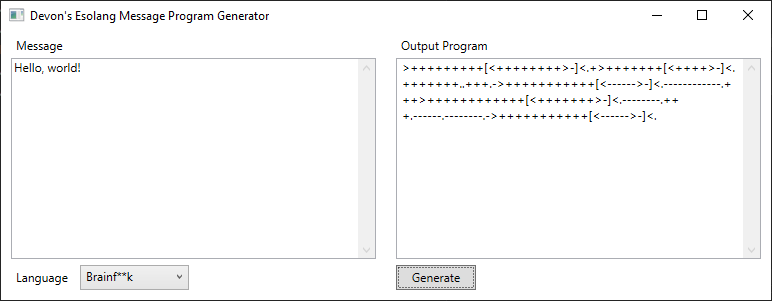

# Devon's Esolang Message Program Generator

An esoteric programming language program generator that displays a message in a chosen language.

## Supports
* [Brainf**k](https://en.wikipedia.org/wiki/Brainfuck)
* [Boolf**k](http://samuelhughes.com/boof/)
* [Whitespace](https://en.wikipedia.org/wiki/Whitespace_(programming_language))
* [LOLCODE](https://en.wikipedia.org/wiki/LOLCODE)
* [LoveLang](https://github.com/DevonArtmeier/LoveLangInterpreter)

## Dependencies
* [Emoji.WPF](https://github.com/samhocevar/emoji.wpf)
